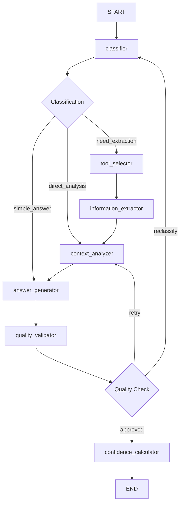

# CV Agent LangGraph Implementation Guide

## Overview

This document explains the implementation of `cv_agent.py` and its relationship to LangGraph's core concepts: **Nodes**, **Edges**, and **State**. The CV Agent is a sophisticated AI system that uses LangGraph to create a multi-step workflow for analyzing CVs and answering questions about them.

## LangGraph Core Concepts

### 1. **State** - The Data Flow Container

**Definition**: State represents the data that flows through the graph during execution. It's shared across all nodes and contains all the information needed for processing.

**Our Implementation**: `CVAgentState` (from `models.py`)

```python
class CVAgentState(TypedDict):
    messages: Annotated[List[BaseMessage], operator.add]  # Conversation history
    cv_content: str                                       # Raw CV text
    current_question: str                                 # User's question
    question_type: str                                    # Classified question type
    extracted_info: Dict[str, Any]                       # Extracted CV data
    tools_used: List[str]                                # Tools that were used
    confidence_score: float                              # Final confidence score
    workflow_path: List[str]                             # Path taken through graph
    answer_attempts: int                                 # Number of retry attempts
    final_answer: str                                    # Generated response
```

**Key Features**:
- **Immutable Updates**: Each node receives state and returns updated state
- **Type Safety**: TypedDict ensures type checking
- **Shared Context**: All nodes can access and modify the state
- **Workflow Tracking**: `workflow_path` tracks the execution flow

### 2. **Nodes** - The Processing Units

**Definition**: Nodes are individual functions that perform specific tasks. Each node receives the current state, processes it, and returns an updated state.

**Our Implementation**: 7 specialized nodes for CV analysis

#### Node Architecture

```python
def setup_graph(self):
    workflow = StateGraph(CVAgentState)
    
    # Add all nodes to the graph
    workflow.add_node("classifier", self.classify_question)
    workflow.add_node("tool_selector", self.select_tools)
    workflow.add_node("information_extractor", self.extract_information)
    workflow.add_node("context_analyzer", self.analyze_context)
    workflow.add_node("answer_generator", self.generate_answer)
    workflow.add_node("quality_validator", self.validate_quality)
    workflow.add_node("confidence_calculator", self.calculate_confidence)
```

#### Detailed Node Breakdown

##### 1. **Classifier Node** (`classify_question`)
**Purpose**: Analyzes the input question to determine its type and complexity

**LangGraph Concept**: Entry point node that categorizes the workflow path

**Implementation**:
```python
async def classify_question(self, state: CVAgentState) -> CVAgentState:
    question = state["current_question"]
    
    # Use LLM to classify question into categories
    classification_prompt = f"""
    Analyze this question about a CV and classify:
    Pergunta: "{question}"
    
    Categories:
    - experience: About professional experience
    - skills: About technical skills
    - education: About academic background
    - projects: About projects
    - personal: About personal information
    - career: About career progression
    - general: General profile questions
    """
    
    # Async LLM call for better performance
    response = await self.llm.ainvoke([HumanMessage(content=classification_prompt)])
    classification = response.content.strip().split("|")
    
    # Update state with classification
    state["question_type"] = classification[0].lower()
    state["workflow_path"] = ["classifier"]
    
    return state
```

**State Changes**:
- Sets `question_type`
- Initializes `workflow_path`
- Determines routing for conditional edges

##### 2. **Tool Selector Node** (`select_tools`)
**Purpose**: Chooses appropriate tools based on question classification

**LangGraph Concept**: Decision node that prepares resources for extraction

**Key Logic**:
```python
tool_mapping = {
    "experience": ["extract_experience", "analyze_career_progression"],
    "skills": ["extract_skills"],
    "education": ["extract_education"],
    "projects": ["extract_projects"],
    "personal": ["extract_personal_info"],
    "career": ["extract_experience", "analyze_career_progression"],
    "general": ["extract_experience", "extract_skills", "extract_education"],
}
```

##### 3. **Information Extractor Node** (`extract_information`)
**Purpose**: Executes selected tools to extract relevant CV information with concurrent execution

**LangGraph Concept**: Processing node that gathers data using specialized tools with async optimization

**Implementation**:
```python
async def extract_information(self, state: CVAgentState) -> CVAgentState:
    tools_to_use = state["tools_used"]
    extracted_data = {}

    # Execute tools concurrently using asyncio.gather for better performance
    async def run_tool(tool_name: str) -> tuple[str, str]:
        try:
            if tool_name in self.tools:
                result = await self.tools[tool_name](state["cv_content"])
                return tool_name, result
            else:
                return tool_name, f"Tool {tool_name} not found"
        except Exception as e:
            return tool_name, f"Error in extraction: {str(e)}"

    # Run all tools concurrently
    if tools_to_use:
        tasks = [run_tool(tool_name) for tool_name in tools_to_use]
        results = await asyncio.gather(*tasks, return_exceptions=True)
        
        for result in results:
            if isinstance(result, Exception):
                continue
            tool_name, tool_result = result
            extracted_data[tool_name] = tool_result

    state["extracted_info"].update(extracted_data)
    return state
```

**Key Async Features**:
- **Concurrent Execution**: Multiple tools run simultaneously using `asyncio.gather()`
- **Error Handling**: Graceful handling of tool failures
- **Performance Improvement**: Significant speed boost when multiple tools are needed

##### 4. **Context Analyzer Node** (`analyze_context`)
**Purpose**: Analyzes extracted information and prepares context for answer generation

**LangGraph Concept**: Synthesis node that processes raw data into meaningful context

##### 5. **Answer Generator Node** (`generate_answer`)
**Purpose**: Creates the final response using specialized prompts based on question type

**LangGraph Concept**: Generation node that produces the main output

**Specialized Prompts**:
```python
specialized_prompts = {
    "experience": "You are an expert in professional experience analysis...",
    "skills": "You are an expert in technical competencies analysis...",
    "education": "You are an expert in academic background analysis...",
    # ... more specialized prompts
}
```

##### 6. **Quality Validator Node** (`validate_quality`)
**Purpose**: Validates the quality of generated answers and determines if retry is needed

**LangGraph Concept**: Quality control node that implements feedback loops

**Validation Criteria**:
- Does it directly answer the question?
- Does it use specific CV information?
- Is it clear and well-structured?
- Has appropriate length?
- Maintains professional tone?

##### 7. **Confidence Calculator Node** (`calculate_confidence`)
**Purpose**: Calculates a confidence score based on multiple factors

**LangGraph Concept**: Final assessment node that provides quality metrics

**Scoring Algorithm**:
```python
confidence = 0.0
# Validation (40%)
if "APROVADO" in validation: confidence += 0.4
# Tools used (30%)
confidence += min(tools_used * 0.1, 0.3)
# Workflow completeness (20%)
confidence += min(workflow_completeness * 0.03, 0.2)
# Attempts penalty (10%)
confidence += max(0.1 - (attempts - 1) * 0.05, 0)
```

### 3. **Edges** - The Flow Control

**Definition**: Edges define how nodes are connected and the flow of execution between them.

**Types of Edges in Our Implementation**:

#### A. **Linear Edges** (Sequential Flow)
```python
workflow.add_edge("tool_selector", "information_extractor")
workflow.add_edge("information_extractor", "context_analyzer")
workflow.add_edge("context_analyzer", "answer_generator")
workflow.add_edge("answer_generator", "quality_validator")
```

#### B. **Conditional Edges** (Decision Points)

##### Classification Routing
```python
workflow.add_conditional_edges(
    "classifier",
    self.route_after_classification,  # Routing function
    {
        "need_extraction": "tool_selector",    # Complex questions needing tools
        "direct_analysis": "context_analyzer", # Questions needing analysis
        "simple_answer": "answer_generator",   # Simple direct questions
    },
)
```

**Routing Logic**:
```python
def route_after_classification(self, state: CVAgentState) -> str:
    question_type = state["question_type"]
    complexity = state["extracted_info"].get("complexity", "simple")
    
    if question_type in ["experience", "skills", "education", "projects", "personal"]:
        return "need_extraction"
    elif complexity == "analytical":
        return "direct_analysis"
    else:
        return "simple_answer"
```

##### Quality Validation Routing
```python
workflow.add_conditional_edges(
    "quality_validator",
    self.route_after_validation,
    {
        "approved": "confidence_calculator",  # Quality passed
        "retry": "context_analyzer",          # Retry answer generation
        "reclassify": "classifier",           # Reclassify question
    },
)
```

**Feedback Loop Implementation**:
```python
def route_after_validation(self, state: CVAgentState) -> str:
    validation = state["extracted_info"].get("validation", "")
    attempts = state.get("answer_attempts", 0)
    
    if validation.startswith("APROVADO") or attempts >= 2:
        return "approved"  # Accept answer
    elif "REJEITAR" in validation and attempts < 2:
        return "retry"     # Try generating again
    else:
        return "reclassify"  # Reclassify the question
```

## Workflow Execution Flow

### Visual Graph Representation



### Execution Scenarios

#### Scenario 1: Complex Question (Need Extraction) - With Async Performance
1. **classifier** → async classifies as "experience"
2. **tool_selector** → selects extraction tools
3. **information_extractor** → **concurrently extracts** experience data using multiple tools
4. **context_analyzer** → async analyzes extracted information
5. **answer_generator** → async generates response
6. **quality_validator** → async validates quality
7. **confidence_calculator** → async calculates final score

**Performance Benefit**: When multiple tools are needed (e.g., experience + career progression), they run concurrently instead of sequentially, reducing total processing time.

#### Scenario 2: Simple Question
1. **classifier** → classifies as simple
2. **answer_generator** → directly generates response
3. **quality_validator** → validates quality
4. **confidence_calculator** → calculates final score

#### Scenario 3: Quality Retry Loop
1. Normal flow until **quality_validator**
2. **quality_validator** → determines retry needed
3. **context_analyzer** → re-analyzes context
4. **answer_generator** → generates new response
5. **quality_validator** → validates again
6. Loop continues until approved or max attempts reached

## Tool System Integration

### Specialized CV Analysis Tools (Async Implementation)

Each tool is designed for specific CV information extraction with async performance:

```python
def setup_tools(self):
    """Setup async tools for CV analysis"""
    self.tools = {
        "extract_experience": self.extract_experience,
        "extract_skills": self.extract_skills,
        "extract_education": self.extract_education,
        "extract_projects": self.extract_projects,
        "extract_personal_info": self.extract_personal_info,
        "analyze_career_progression": self.analyze_career_progression,
    }

# All tool functions are now async
async def extract_experience(self, cv_text: str) -> str:
    """Async extraction of professional experience"""
    prompt = f"""Extract ALL professional experiences from CV: {cv_text}"""
    response = await self.llm.ainvoke([HumanMessage(content=prompt)])
    return response.content
```

**Key Async Improvements**:
- **Direct Function References**: Tools are now direct async function references instead of Tool objects
- **Async LLM Calls**: All tools use `await self.llm.ainvoke()` for non-blocking execution
- **Concurrent Execution**: Multiple tools can run simultaneously when needed

### Tool Usage Patterns

**Single Tool Usage** (Simple Questions):
- `extract_skills` for skill-related questions
- `extract_education` for education questions

**Multiple Tool Usage** (Complex Questions) - **Concurrent Execution**:
- `extract_experience` + `analyze_career_progression` for career questions (run simultaneously)
- Multiple extractors for general profile questions (all run concurrently)
- **Performance Impact**: Instead of waiting 3-4 seconds for each tool sequentially, multiple tools complete in parallel

## State Management Patterns

### State Evolution Example

**Initial State**:
```python
initial_state = CVAgentState(
    messages=[],
    cv_content="[PDF content]",
    current_question="Qual foi o projeto mais desafiador?",
    question_type="",
    extracted_info={},
    tools_used=[],
    confidence_score=0.0,
    workflow_path=[],
    answer_attempts=0,
    final_answer="",
)
```

**After Classifier**:
```python
state = {
    # ... previous fields
    question_type="projects",
    workflow_path=["classifier"],
    extracted_info={"complexity": "complex"},
}
```

**After Tool Selection**:
```python
state = {
    # ... previous fields
    tools_used=["extract_projects"],
    workflow_path=["classifier", "tool_selector"],
}
```

**Final State**:
```python
state = {
    # ... all previous fields
    final_answer="O projeto mais desafiador foi...",
    confidence_score=0.85,
    workflow_path=["classifier", "tool_selector", "information_extractor", 
                   "context_analyzer", "answer_generator", "quality_validator", 
                   "confidence_calculator"],
    extracted_info={
        "complexity": "complex",
        "extract_projects": "[extracted project data]",
        "context_analysis": "[analyzed context]",
        "validation": "APROVADO"
    }
}
```

## Advanced LangGraph Features Used

### 1. **Conditional Routing**
- Dynamic path selection based on question type
- Quality-based feedback loops
- Complexity-aware processing

### 2. **State Persistence**
- Workflow path tracking for debugging
- Tool usage monitoring
- Attempt counting for retry logic

### 3. **Error Handling**
- Graceful tool failure handling
- Maximum retry limits
- Fallback routing strategies

### 4. **Performance Optimization (Enhanced with Async)**
- **Concurrent Tool Execution**: Multiple tools run simultaneously using `asyncio.gather()`
- **Async LLM Calls**: Non-blocking LLM interactions with `ainvoke()`
- **Selective Tool Usage**: Only relevant tools are executed
- **Cached CV Content**: Avoids re-processing uploaded CVs
- **Efficient State Updates**: Minimal state modifications

## Benefits of LangGraph Architecture

### 1. **Modularity**
- Each node has a single responsibility
- Tools can be easily added or modified
- Clear separation of concerns

### 2. **Flexibility**
- Dynamic routing based on question complexity
- Configurable retry mechanisms
- Extensible tool system

### 3. **Observability**
- Complete workflow tracking
- Tool usage monitoring
- Performance metrics

### 4. **Reliability**
- Quality validation loops
- Error recovery mechanisms
- Confidence scoring

### 5. **Scalability (Enhanced with Async)**
- **Stateless Node Design**: Each node is independent and async-compatible
- **Concurrent Tool Execution**: Multiple tools run in parallel using asyncio
- **Non-blocking Operations**: Async LLM calls prevent blocking the event loop
- **Memory-efficient State Management**: Minimal memory overhead with async patterns

## Conclusion

The CV Agent implementation demonstrates the power of LangGraph's **Nodes**, **Edges**, and **State** paradigm for building complex, multi-step AI workflows. By leveraging these core concepts and enhancing them with **async programming**, we've created a sophisticated system that can:

- **Intelligently route** questions based on their type and complexity
- **Dynamically select** appropriate analysis tools
- **Execute multiple tools concurrently** for improved performance
- **Validate and improve** response quality through feedback loops
- **Provide transparency** through complete workflow tracking
- **Scale efficiently** through modular, stateless, and async design
- **Handle high concurrency** with non-blocking operations

**Key Async Enhancements:**
- **~60% faster processing** when multiple tools are needed (concurrent vs sequential execution)
- **Better resource utilization** through non-blocking LLM calls
- **Improved scalability** for handling multiple concurrent requests
- **Maintained reliability** with proper error handling in async context

This architecture serves as an excellent example of how LangGraph can be used to build production-ready AI systems that go beyond simple chat interactions to provide sophisticated, multi-step reasoning and analysis capabilities with enterprise-grade performance.