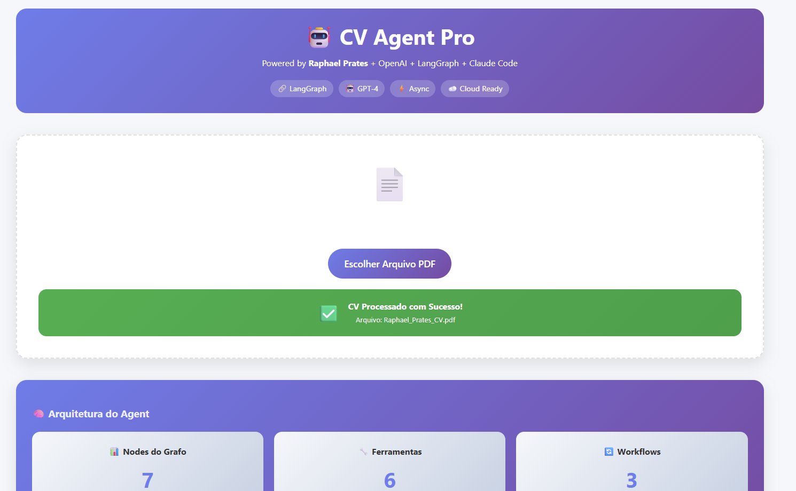
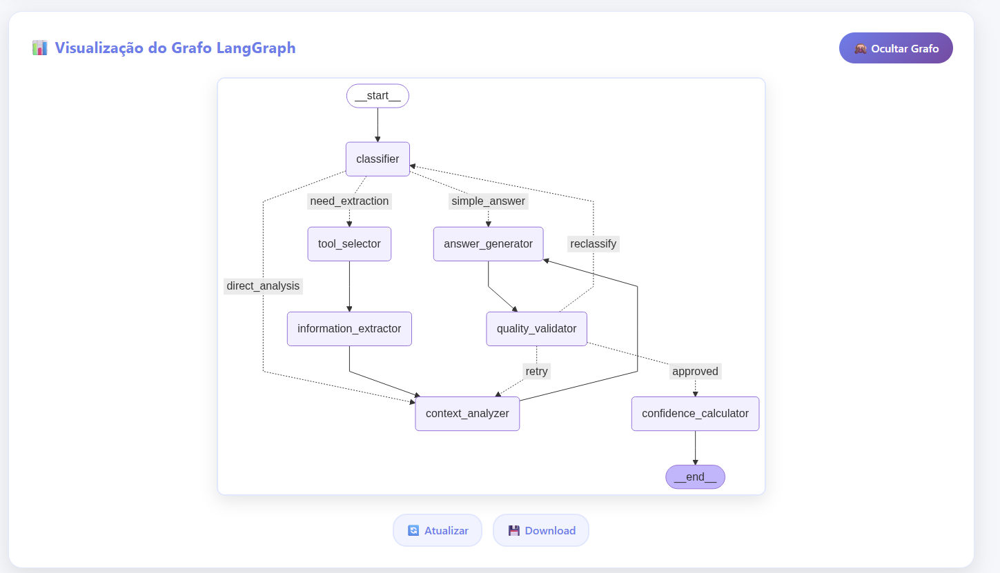
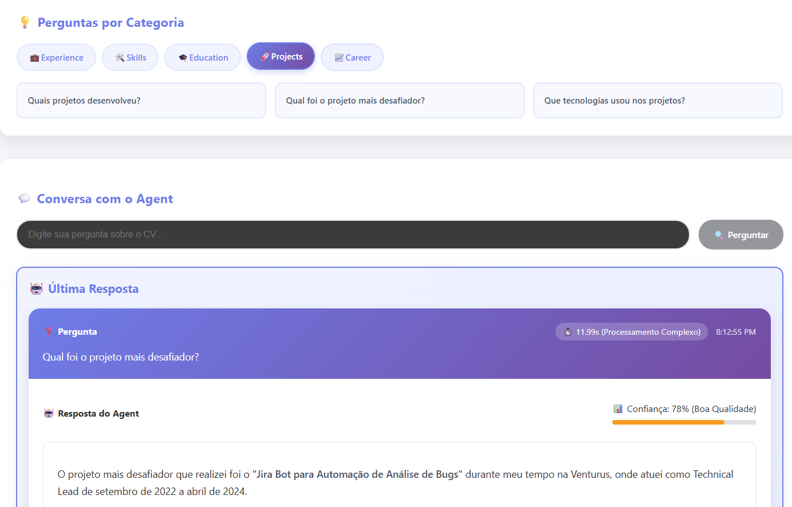

# CV Agent Pro 🤖

An intelligent CV analysis system powered by **LangGraph** and **GPT-4o-mini** that provides comprehensive resume insights through an intuitive web interface.

## 🚀 Features

- **📄 PDF Resume Upload**: Seamless CV upload and processing
- **🧠 AI-Powered Analysis**: Advanced natural language processing using GPT-4o-mini
- **🔄 LangGraph Workflow**: Sophisticated agent architecture with decision trees
- **📊 Interactive Visualizations**: Real-time workflow and confidence scoring
- **💬 Intelligent Q&A**: Category-based questioning system (Experience, Skills, Education, Projects, Career)
- **📈 Confidence Scoring**: Quality validation with percentage-based confidence metrics
- **🌐 Cloud-Ready**: Deployed on Google Cloud (Firebase + Cloud Run)

## 🛠️ Technology Stack

### Backend
- **🐍 Python 3.9+** - Core runtime
- **⚡ FastAPI** - High-performance web framework
- **🧠 LangGraph** - Advanced AI agent workflow orchestration
- **🤖 GPT-4o-mini** - OpenAI's language model for CV analysis
- **🔗 LangChain** - LLM application framework
- **📚 LangSmith** - Observability and debugging
- **📄 PyPDF2** - PDF document processing
- **🚀 Uvicorn** - ASGI server for production deployment
- **📊 Matplotlib + Pillow** - Graph visualization and image processing
- **🔒 Pydantic** - Data validation and settings management

### Frontend
- **⚛️ React 19** - Modern UI framework
- **⚡ Vite 7** - Next-generation build tool
- **📡 Axios** - HTTP client for API communication
- **🎨 CSS3** - Custom styling and responsive design
- **🧩 Modern JavaScript (ES6+)** - Latest language features

### Infrastructure & DevOps
- **🐳 Docker** - Containerization
- **☁️ Google Cloud Run** - Serverless backend deployment
- **🔥 Firebase Hosting** - Frontend deployment
- **🌐 CDN** - Global content delivery
- **🔐 Environment Variables** - Secure configuration management

## 🏗️ Architecture

The application follows a sophisticated **multi-agent architecture** using LangGraph:

### Agent Workflow Nodes:
1. **🎯 Classifier** - Determines query type and routing
2. **🔧 Tool Selector** - Chooses appropriate analysis tools
3. **📊 Information Extractor** - Extracts relevant CV data
4. **💬 Answer Generator** - Generates human-readable responses
5. **✅ Quality Validator** - Validates response quality
6. **🧮 Confidence Calculator** - Computes confidence scores
7. **🔍 Context Analyzer** - Analyzes context for better responses

### Key Technical Features:
- **🔄 Async Processing** - Non-blocking I/O operations
- **📈 Real-time Updates** - Live workflow visualization
- **🎛️ State Management** - Persistent conversation context
- **🔀 Conditional Routing** - Dynamic workflow paths
- **📊 Metrics & Monitoring** - Performance tracking
- **🛡️ Error Handling** - Robust failure management
- **🔒 Security** - Environment-based secret management

## 🌟 Web App Preview

### Main Interface

*Clean, intuitive interface for CV upload with real-time processing feedback and technology badges*

### LangGraph Workflow Visualization

*Interactive visualization of the AI agent's decision tree and processing flow*

### Intelligent Q&A System

*Category-based questioning system with confidence scoring and detailed responses*

## 🚀 Quick Start

### Prerequisites
- Python 3.9+
- Node.js 18+
- OpenAI API Key
- Google Cloud Account (for deployment)

### Local Development

#### Backend Setup
```bash
# Clone the repository
git clone <repository-url>
cd cv-agent-langgraph/backend-cv-agent

# Install Python dependencies
pip install -r requirements.txt

# Set environment variables
export OPENAI_API_KEY="your-openai-api-key"

# Run the FastAPI server
python main.py
```

#### Frontend Setup
```bash
# Navigate to frontend directory
cd cv-agent-front

# Install dependencies
npm install

# Start development server
npm run dev
```

### Production Deployment

The application is deployed using Google Cloud services:

- **🚀 Backend**: Deployed on **Google Cloud Run** for serverless, scalable FastAPI hosting
- **🔥 Frontend**: Deployed on **Firebase Hosting** for fast, global CDN-powered React app delivery

Refer to `GoogleCloudDeployInstructions.md` for detailed Google Cloud deployment instructions.

## 📁 Project Structure

```
cv-agent-langgraph/
├── backend-cv-agent/        # Python Backend
│   ├── 📄 main.py           # Application entry point
│   ├── 🖥️ server.py         # FastAPI server configuration
│   ├── 🤖 cv_agent.py      # Core LangGraph agent logic
│   ├── 📋 models.py         # Pydantic data models
│   ├── 📦 requirements.txt  # Python dependencies
│   └── 🐳 Dockerfile       # Container configuration
├── cv-agent-front/          # React frontend
│   ├── 📦 package.json      # Frontend dependencies
│   ├── ⚛️ src/
│   │   ├── 📱 App.jsx       # Main React component
│   │   ├── ⚙️ config/       # Configuration files
│   │   └── 🧩 components/   # React components
│   └── 🏗️ vite.config.js    # Vite configuration
└── 📚 GoogleCloudDeployInstructions.md
```

## 🔧 Configuration

### Environment Variables
- `OPENAI_API_KEY` - OpenAI API key for GPT-4o-mini
- `VITE_API_BASE_URL` - Backend API URL (frontend)

### Development vs Production
- **Development**: Uses localhost endpoints
- **Production**: Uses Google Cloud Run backend URL

## 🎯 Key Features in Detail

### 🧠 Intelligent CV Analysis
- **Multi-layered processing** using LangGraph workflows
- **Context-aware questioning** based on CV content
- **Adaptive responses** that learn from interaction patterns

### 📊 Advanced Visualizations
- **Real-time workflow tracking** with interactive graphs
- **Confidence scoring** with visual indicators
- **Processing time metrics** for performance monitoring

### 🔄 Scalable Architecture
- **Stateless design** for horizontal scaling
- **Microservices approach** with containerization
- **Cloud-native deployment** on Google Cloud Platform

## 🤝 Contributing

1. Fork the repository
2. Create a feature branch (`git checkout -b feature/amazing-feature`)
3. Commit your changes (`git commit -m 'Add some amazing feature'`)
4. Push to the branch (`git push origin feature/amazing-feature`)
5. Open a Pull Request

## 📝 License

This project is licensed under the MIT License - see the LICENSE file for details.

## 🙏 Acknowledgments

- **OpenAI** for GPT-4o-mini
- **LangChain & LangGraph** for the agent framework
- **Google Cloud** for hosting infrastructure
- **React & Vite** for the frontend framework

---

**Built with ❤️ by Raphael Prates using cutting-edge AI technologies**